### Before you begin
Please install the following tools you need.
For linux/mac os x users, it is recommended to install them by the package manager of your linux system.
For windows users, you can link to following sites and install them by instruction.
* git https://git-scm.com/download/win
* python https://www.python.org/ftp/python/3.6.0/python-3.6.0a3-amd64.exe
  please remember to add python to enviroment path while installing.
* cloudfoundry-cli https://github.com/cloudfoundry/cli/releases
* Ensure that you have a [Bluemix account](https://console.ng.bluemix.net/registration/). You can register for a 30 days free-trial.
* git clone https://github.com/WeijianL1/COMP523-Mr-Reese

###Facebook messenger API setup

* [Create Facebook fan page](https://www.facebook.com/pages/create) and application
* Create an messenger app on  [facebook for developers website](https://developers.facebook.com/apps/).
* Click 'Add Product' -> 'Messenger'. 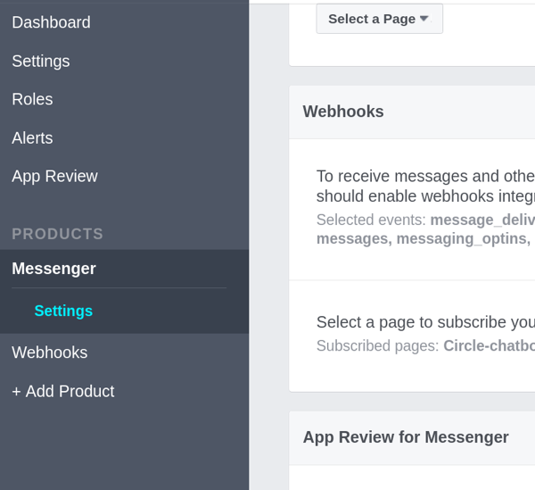
* Generate fan page Token
   * replicate the .env.example and rename it to .env
   * Choose your fanpage at Select a Page, and copy the page access token. Edit the .env and replace the FB_TOKEN token.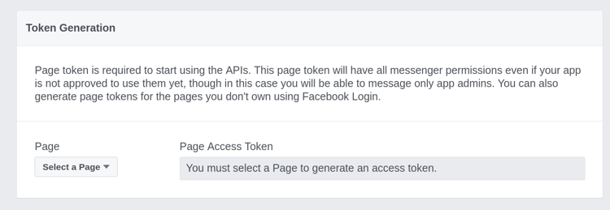

### Create the services

1. In Bluemix, [create a Conversation Service instance](https://console.ng.bluemix.net/registration/?target=/catalog/services/conversation/).

2. In Bluemix, [create a Discovery Service instance](https://console.ng.bluemix.net/registration/?target=/catalog/services/discovery/).

3. In Bluemix, [create a Natural Language Understanding instance](https://console.bluemix.net/catalog/services/natural-language-understanding)

4. In Bluemix, [create a ClearDB Managed MySQL instance](https://console.bluemix.net/catalog/services/cleardb-managed-mysql-database)
5. In Bluemix, create a Weather Company Data instance

###Set Up Conversation
* Creat a Workspace 
  * ​click on the upload button and choose the conversation_workSpace.json in Data folder
  * 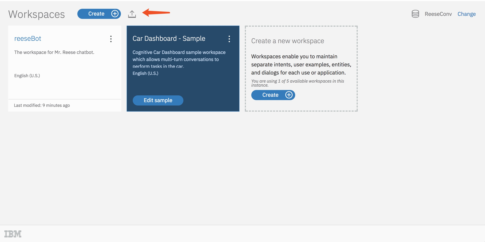

###Set Up Discovery
* Click on "Launch Tool"
* Create two new collections (one for spreadsheet and another for news feed)
  * First click on "create a data collection"
  * Type you collection name 
  * And then click on "Create"
  * 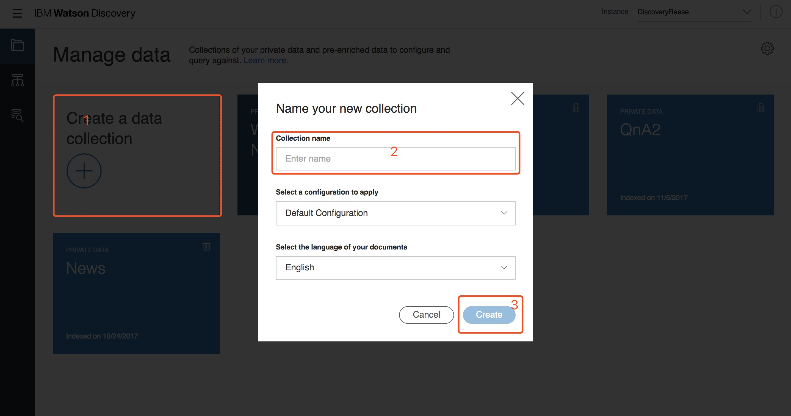
* Click into the spreadsheet collection
* Load data into this collection by clicking "Upload Documents"
* 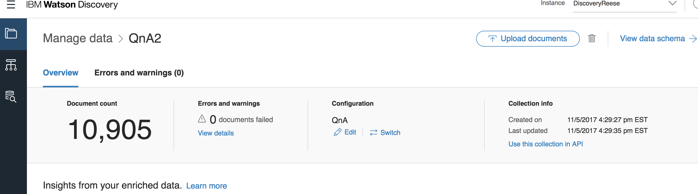


###Deploy the server code to Bluemix
* Fill out the .env file. 


  * Conversation: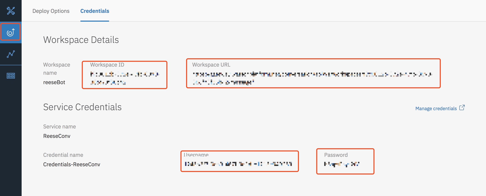

  * Discovery: (for both collections)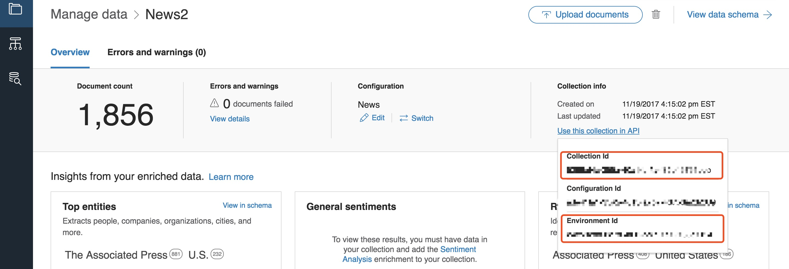

  * Weather: 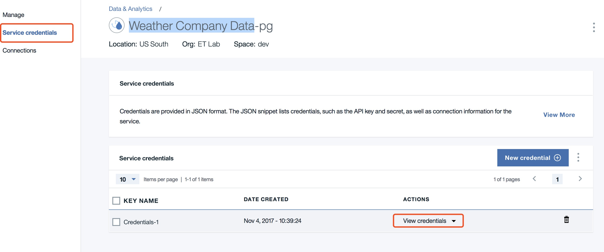

  * NLP: 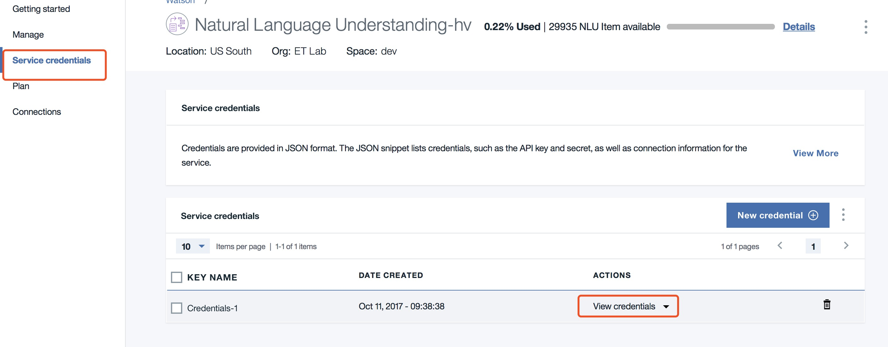

  * MySQL: 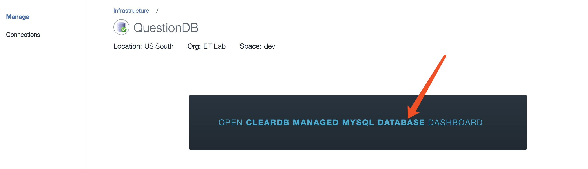

    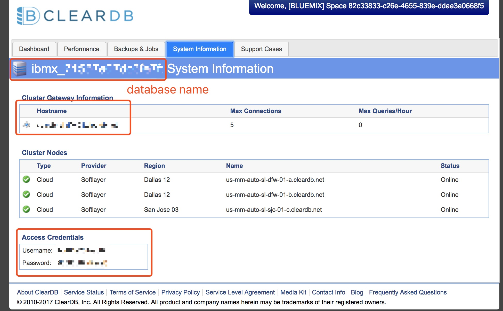

* [install cli command](https://docs.cloudfoundry.org/cf-cli/install-go-cli.html)

* In your terminal under the root directory of app.js:

   ```
   cf login -a https://api.ng.bluemix.net
   ```

* Type in your IBM username and keywords

* Adjust manifest.yml

* In terminal:

   ```
   cf push
   ```

### Connect webhook with Bluemix
* Once the broker app is successfully executed in the cloud, go back to the Facebook developer page to set up the webhook.
* Callback URL: fill in the broker url (eg. https://yourname-broker.mybluemix.net/webhook)
* Verification Token: Any non-empty string
  * Subscription Field:
  * message_deliveries
  * message_reads
  * messages
  * messaging_optins
  * message_postbacks  should be checked
* Select a page to subscribe your webhook to the page events

